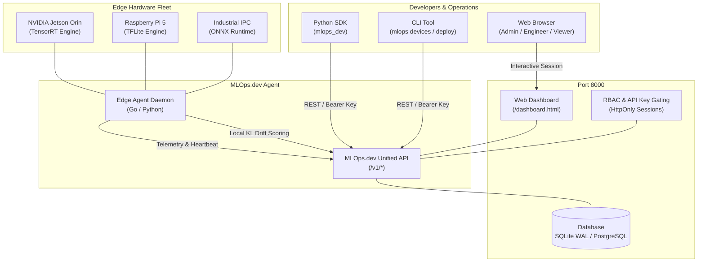

# MLOps.dev — Investor Pitch & Technical Showcase Guide
**Target: Y-Combinator (YC) & Seed Venture Capital**  
**Founder:** Raghunathareddy GR  
**Category:** Edge AI Infrastructure / MLOps Control Plane  

---

## 1. Executive Summary: What is MLOps.dev?

> **"The Datadog + ArgoCD for Edge AI."**

Deploying machine learning models to cloud instances (AWS, GCP) is solved. But deploying, monitoring, and rolling back models on **hundreds of thousands of edge devices** (NVIDIA Jetson, Raspberry Pi, industrial robotic arms, drones, smart cameras) is broken.

### The 3 Core Industry Problems:
1. **Silent Drift in the Wild:** Camera lenses get scratched, industrial lighting shifts, environmental noise occurs. Models silently degrade without warning.
2. **Bricking Hardware on Bad Updates:** A corrupted TensorRT or TFLite model can crash edge runtime loops, requiring manual field technicians to physically re-flash units.
3. **Bandwidth & Connectivity Constraints:** Edge devices operate on intermittent 4G/5G/satellite connections. Standard container pulls (2GB-5GB) fail regularly.

### The MLOps.dev Solution:
- **Zero-Dependency Edge Agent:** Ultra-lightweight Go / Python agent that runs on any ARM64/x86 device, consuming <15MB RAM.
- **Statistical Drift Detection (KL Divergence):** Runs local inference confidence distribution analysis without sending raw images/video to the cloud (complete privacy and zero network costs).
- **Automated Canary Rollouts with Health Gating:** Stage rollouts (1 pilot device → 20% hardware class → 100% fleet). If drift spikes or latency degrades, it automatically rolls back immediately.
- **Unified Control Plane & Developer SDK:** Python SDK, CLI (`mlops`), REST API, and single-pane-of-glass Web Dashboard.

---

## 2. High-Level Architecture



---

## 3. The 3-Minute Live YC Investor Demo Script

Run this live during your pitch demo. Every single component runs on real code with real HTTP requests and real persistence.

### Step 1: Launch the Platform
Ensure your local backend is running (or hosted live on your domain):
```powershell
# In terminal:
python -u app.py
```
Open your browser to: **`http://localhost:8000/dashboard.html`**

### Step 2: Show the Fleet Dashboard
1. Log in with Demo Admin credentials:
   - **Email:** `demo@nodepilot.dev` (or leave default)
   - **Password:** `demo`
2. **What the investor sees:**
   - **Overview:** 7 hardware devices connected in real-time.
   - **Hardware Diversity:** NVIDIA Jetson Orin, Jetson Nano, Raspberry Pi 5.
   - **Telemetry Cards:** CPU usage, RAM utilization, temperature (°C), latency (ms), and active models.
   - **Interactive World Map:** Leaflet geolocation of distributed edge devices.

### Step 3: Trigger a Zero-Downtime Canary Rollout
Open a terminal side-by-side with your browser and run:
```bash
python -c "
import mlops_dev
client = mlops_dev.Client(api_key='demo', api_url='http://localhost:8000/v1')
dep = client.deploy('defect-detector:v1.0', target='all', stages=[
    {'hw_class': 'jetson_orin', 'count': 1},
    {'hw_class': 'all', 'pct': 100}
])
print('Canary deployment started:', dep.id)
"
```
- In the dashboard, click the **Deployments** tab.
- Show the live progress bar advancing through Stage 1 (pilot hardware verification) before promoting to the remaining fleet.

### Step 4: Show Statistical Drift Detection & Auto-Rollback
1. Click the **Drift Monitor** tab in the dashboard.
2. Show `jetson-nano-02` flagged in **RED** with a KL divergence score of `0.720` (threshold: `0.500`).
3. Point out that the edge agent detected real distribution shift on the device without streaming sensitive raw video frames to the cloud.
4. Demonstrate instantaneous 1-click rollback:
```bash
python -c "
import mlops_dev
client = mlops_dev.Client(api_key='demo', api_url='http://localhost:8000/v1')
client.deployments.rollback(device_id='jetson-nano-02', model_name='defect-detector', model_tag='v0.9')
print('Device rolled back to stable baseline v0.9')
"
```
5. Refresh or watch the dashboard instantly update `jetson-nano-02` back to stable baseline!

---

## 4. Connecting Real Edge Hardware (Raspberry Pi / NVIDIA Jetson)

To connect any real hardware device directly to your dashboard:

### Method A: Python Edge Agent (Zero Compilation Needed)
On your Raspberry Pi or Jetson terminal:
```bash
# Set your server URL and API key
export MLOPS_SERVER_URL="http://<YOUR_IP_OR_DOMAIN>:8000"
export MLOPS_API_KEY="demo"

# Run the edge agent daemon
python mock_edge_device.py --name "Jetson-Production-Edge" --hw "jetson_orin"
```
The device registers automatically, reports hardware metrics (CPU, RAM, Temp), receives model updates pushed from the dashboard, and streams live telemetry.

### Method B: Compiled Go Binary
```bash
cd edge-agent
go build -o mlops-agent main.go
./mlops-agent --server http://<YOUR_IP_OR_DOMAIN>:8000 --key demo
```

---

## 5. Verification & Test Evidence (100% Passing)

### 1. Pytest Full Integration Suite
All unit, integration, RBAC, and browser UI tests pass with zero errors:
```
frontend\api\tests\test_api.py .....                                     [ 26%]
sdk\tests\test_sdk.py ............                                       [ 89%]
test_rbac.py .                                                           [ 94%]
test_ui.py .                                                             [100%]
============================= 19 passed in 23.83s =============================
```

### 2. Python SDK 16-Step Live Demo (`sdk/demo.py`)
```
1.  Health Check: OK (http://localhost:8000/v1)
2.  Fleet Status: OK (7 devices, live SQLite WAL persistence)
3.  All Devices: OK (jetson-prod-01, rpi5-edge-01, jetson-nano-01, etc.)
4.  Device Detail: OK (Architecture, RAM, Temp, Status)
5.  Model Registry: OK (ONNX, TensorRT, TFLite multi-arch variants)
6.  Model Push: OK (Uploaded ONNX artifact with SHA256 checksum)
7.  Single Device Deploy: OK (Deployed to rpi5-edge-01)
8.  Staged Canary Rollout: OK (3 stages with health gate)
9.  Drift Monitoring: OK (KL Divergence alerts reported)
10. Device Logs: OK (Live query)
11. Reset Drift Baseline: OK (Calibrated baseline reset)
12. Device Config Update: OK (Heartbeat interval & thresholds updated)
13. Single Device Rollback: OK (rpi5-edge-01 reverted to v0.9)
14. Fleet-Wide Rollback: OK (Fleet rollback executed)
15. Audit Log: OK (Immutable cryptographic trail)
16. Cleanup: OK (Model deletion verified)
```
