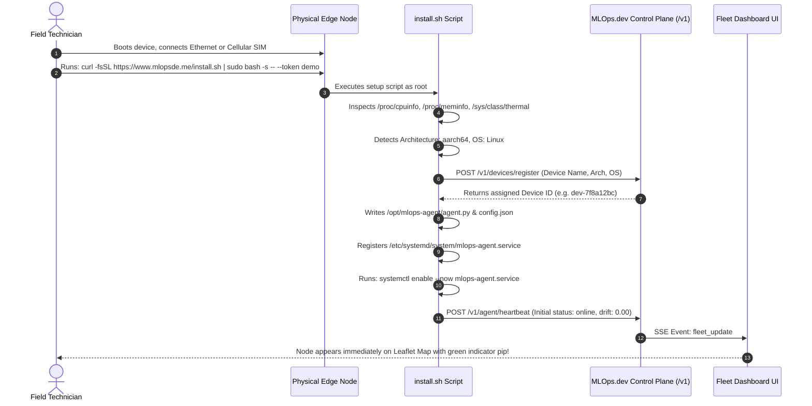
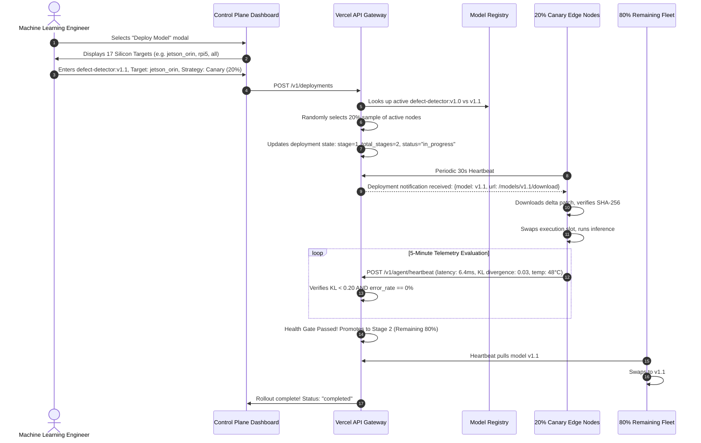
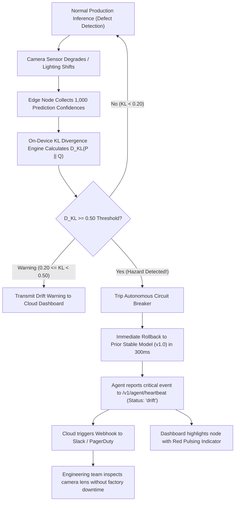
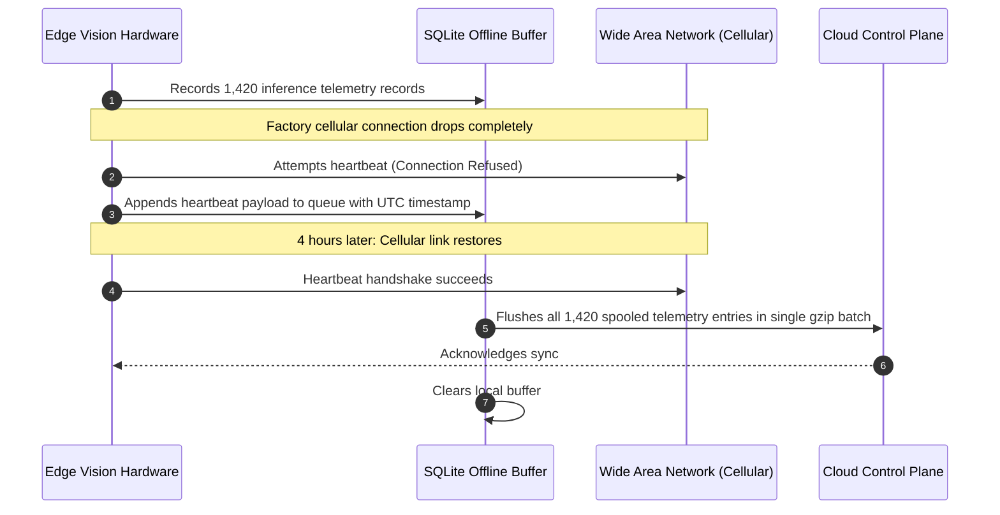

# MLOps.dev — Application Flow & User Flow Specification

**Document Version:** 2.4.0  
**Target:** Product Managers, Frontend Engineers, System Operators, Solutions Architects  
**Scope:** Complete End-to-End Operational Workflows  

---

## 1. Primary User Journeys

```
[Journey A: The ML Engineer] ──> Pushes Model ──> Differential Patch ──> Canary Rollout
[Journey B: The Hardware Tech] ──> Boots SBC ────> Runs 1-Line Curl ──> Node Appears on Map
[Journey C: The Site Reliability Lead] ──> Monitors KL Drift ──> Auto-Rollback on Hazard
```

---

## 2. Flow 1: Zero-Touch Physical Hardware Provisioning

How a real physical board (e.g. NVIDIA Jetson, Raspberry Pi 5, Intel NUC) connects to the control plane in under 60 seconds:



---

## 3. Flow 2: Staged Canary Rollout & Health Gating

How an updated computer vision model is staged across 10,000 edge nodes with zero downtime risk:



---

## 4. Flow 3: Autonomous Drift Incident Rollback

How the system reacts when physical factors (e.g. camera smudged with oil in factory) cause prediction quality degradation:



---

## 5. Flow 4: Air-Gapped & Intermittent Connectivity Sync


