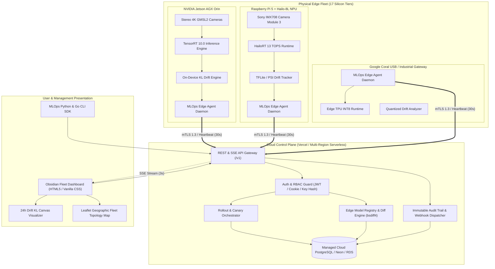
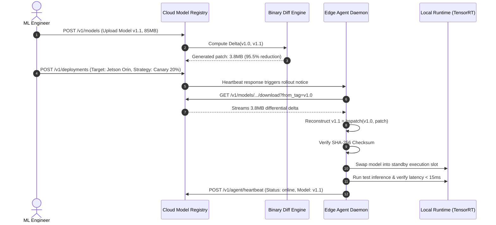
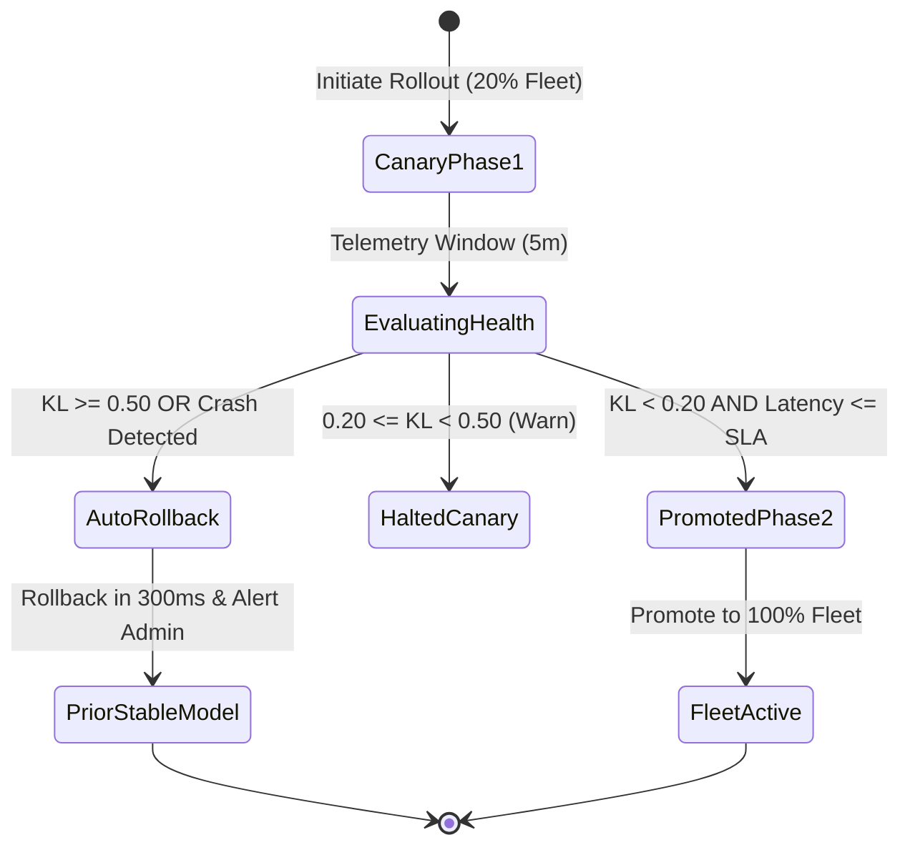

# MLOps.dev — System Architecture Specification

**Document Version:** 2.4.0  
**Target Audience:** Staff Software Engineers, Distributed Systems Architects, Investor Due Diligence  
**Architecture Classification:** Distributed Edge-to-Cloud Orchestration & Zero-Trust Control Plane  

---

## 1. High-Level System Architecture

MLOps.dev decouples the cloud control plane from the distributed edge execution plane. Edge nodes operate with high autonomy, maintaining offline inference continuity even during extended wide-area network (WAN) partition events.



---

## 2. Edge Agent Subsystem Architecture

The edge agent runs as a native background daemon managed via systemd (`mlops-agent.service`). It is built in Go for maximum runtime efficiency with a Python fallback runtime for zero-dependency universal installation.

### 2.1 Component Structure

```
/opt/mlops-agent/
├── agent.py                 # Core polling & execution daemon
├── mlops-agent              # Compiled native Go binary (optional)
├── config.json              # Local device configuration & token
├── buffer.db                # SQLite zero-data-loss telemetry queue
└── models/                  # Active and staged binary weights
    ├── defect-detector_v1.0.bin
    └── staged_v1.1.patch
```

### 2.2 Offline Resilience & Zero-Data-Loss Spooling
When network connectivity is severed (e.g. factory outage or mobile AMR tunnel loss):
1. The edge agent continues executing local model inference at full line rate.
2. Inference telemetry, latency metrics, and computed drift scores are written directly to local SQLite `buffer.db`.
3. An exponential backoff retry loop (`10s`, `20s`, `40s`, max `300s`) monitors WAN health.
4. Upon link restoration, all spooled telemetry is batched and flushed to `/v1/agent/heartbeat` in chronological order.

### 2.3 On-Device Hardware HAL (Hardware Abstraction Layer)

The agent dynamically interrogates sysfs and procfs to extract authentic silicon metrics without third-party dependencies:

| Metric | Source Path / Subsystem | Sampling Rate |
| :--- | :--- | :--- |
| **CPU Utilization** | `/proc/loadavg` & `/proc/stat` delta | Every 30s |
| **Memory Footprint** | `/proc/meminfo` (MemTotal - MemAvailable) | Every 30s |
| **Silicon Core Temperature** | `/sys/class/thermal/thermal_zone0/temp` | Every 30s |
| **Jetson GPU Telemetry** | `/sys/devices/gpu.0/load` & Tegra sysfs | Every 30s |
| **NPU Core Utilization** | HailoRT driver / `/dev/hailo0` or Edge TPU libusb | On inference cycle |

---

## 3. Cloud Control Plane & Storage Architecture

### 3.1 Serverless Application Shell (`frontend/api/index.py`)
Built on Flask with production-hardened middleware:
- **Talisman Security Headers:** Strict CSP, `X-Frame-Options: SAMEORIGIN`, `X-Content-Type-Options: nosniff`.
- **CORS Whitelist:** Explicit cross-origin boundary restricted to `https://www.mlopsde.me` and `https://mlopsde.me`.
- **Flask-Limiter:** Global rate limiting (100 req/min default, 5 req/min on `/v1/auth/login` and `/v1/auth/register`).
- **Payload Sanitization:** Hard 16MB maximum payload cutoff to defeat buffer overload and decompression bomb attacks.

### 3.2 Dual-Engine Database Abstraction (PostgreSQL + SQLite)

MLOps.dev features an adaptive database wrapper (`DBWrapper`):
- **Cloud Production:** Connects to PostgreSQL (`DATABASE_URL`) with autocommit, transaction pooling, and `RealDictCursor`.
- **Local Dev / Air-Gapped:** Falls back automatically to SQLite (`mlops.db`) with identical query syntax translation (`?` converted dynamically to `%s`).

#### Relational Schema Architecture

```sql
-- Edge Devices Matrix
CREATE TABLE devices (
    id TEXT PRIMARY KEY,
    owner_id TEXT NOT NULL REFERENCES api_keys(id),
    name TEXT NOT NULL,
    hw_class TEXT NOT NULL,
    os_info TEXT,
    model_name TEXT,
    model_ver TEXT,
    model_tag TEXT,
    status TEXT DEFAULT 'online',
    drift_score REAL DEFAULT 0.0,
    latency_ms REAL DEFAULT 0.0,
    last_seen TIMESTAMP DEFAULT CURRENT_TIMESTAMP
);

-- Edge Model Registry
CREATE TABLE models (
    id TEXT PRIMARY KEY,
    owner_id TEXT NOT NULL REFERENCES api_keys(id),
    name TEXT NOT NULL,
    tag TEXT NOT NULL,
    format TEXT NOT NULL,        -- 'onnx', 'tensorrt', 'tflite', 'rknn', 'hef'
    variant TEXT DEFAULT 'all',  -- 'jetson_orin', 'coral', 'rpi5', etc.
    size_bytes INTEGER DEFAULT 0,
    sha256 TEXT NOT NULL,
    metadata TEXT DEFAULT '{}',
    created_at TIMESTAMP DEFAULT CURRENT_TIMESTAMP,
    UNIQUE(name, tag, variant)
);

-- Progressive Canary Deployments
CREATE TABLE deployments (
    id TEXT PRIMARY KEY,
    owner_id TEXT NOT NULL REFERENCES api_keys(id),
    model_name TEXT NOT NULL,
    model_tag TEXT NOT NULL,
    status TEXT NOT NULL,         -- 'pending', 'in_progress', 'completed', 'aborted'
    stage INTEGER DEFAULT 1,
    total_stages INTEGER DEFAULT 2,
    target TEXT NOT NULL,         -- 'all', 'jetson_orin', or specific device ID
    health_gate TEXT DEFAULT '{}',
    stages TEXT DEFAULT '{}',
    created_at TIMESTAMP DEFAULT CURRENT_TIMESTAMP
);
```

---

## 4. Model Delivery & Binary Patching Architecture

Pushing full weights (e.g. 100MB–1GB) over industrial cellular networks causes deployment failures. MLOps.dev employs differential binary diffing via **bsdiff4**:



---

## 5. Statistical Drift Detection Math

Edge nodes capture streaming prediction confidence scores $P$ and compare them against the training baseline distribution $Q$ partitioned into $K = 10$ probability quantiles.

$$\mathcal{D}_{\text{KL}}(P \parallel Q) = \sum_{k=1}^{K} P(k) \ln\left(\frac{P(k)}{Q(k)}\right)$$

To ensure numerical stability when a quantile contains zero counts, epsilon smoothing is applied:

$$P'(k) = \frac{P(k) + \epsilon}{\sum_{j} (P(j) + \epsilon)}, \quad \epsilon = 10^{-6}$$

### Canary Circuit Breaker State Machine


