# MLOps.dev — Complete Backend Schema Specification

**Document Version:** 2.4.0  
**Database Engines:** PostgreSQL 15+ (Cloud Production) / SQLite 3.35+ (Local & Air-Gapped)  
**Classification:** Deep Tech Architecture & Data Modeling Standard  

---

## 1. Entity-Relationship Diagram (ERD)

```mermaid
erDiagram
    API_KEYS ||--o{ DEVICES : owns
    API_KEYS ||--o{ MODELS : publishes
    API_KEYS ||--o{ DEPLOYMENTS : orchestrates
    API_KEYS ||--o{ EVENTS : triggers
    API_KEYS ||--o{ AUDIT_LOG : audits
    API_KEYS ||--o{ TEAM_MEMBERS : grants
    API_KEYS ||--o{ WEBHOOKS : dispatches
    
    DEVICES ||--o{ DRIFT_ALERTS : monitors
    DEVICES ||--o{ AUDIT_LOG : generates
    
    MODELS ||--o{ DEPLOYMENTS : deployed_in

    API_KEYS {
        string id PK "Unique Tenant / User Identifier (e.g. 'admin')"
        string key_hash UK "Salted SHA-256 Digest of API Key"
        string name "User Name or Email"
        string stripe_customer_id "Stripe Customer ID"
        string subscription_tier "free | pro | enterprise"
        string subscription_status "active | trialing | past_due | canceled"
        int device_limit "Maximum Enrolled Nodes Allowed"
        string role "admin | member | viewer"
        string approval_status "approved | pending | rejected"
        timestamp created_at "Account Registration UTC Timestamp"
    }

    DEVICES {
        string id PK "Unique Edge Node Hardware UUID (e.g. 'hw-jetson-agx-orin-01')"
        string owner_id FK "References api_keys(id)"
        string name "Human-Readable Edge Node Name"
        string hw_class "Silicon Class: jetson_orin | rpi5_hailo | coral_tpu | etc."
        string os_info "OS Kernel and Distribution Release"
        string model_name "Currently Deployed Model Identifier"
        string model_ver "Model Version Identifier"
        string model_tag "Model Tag (e.g. 'v1.0')"
        string status "online | offline | warning | drift | updating"
        float drift_score "Live Kullback-Leibler (KL) Divergence (0.00 to 1.00)"
        float latency_ms "Last Recorded Inference Latency in Milliseconds"
        timestamp last_seen "Heartbeat Liveness UTC Timestamp"
    }

    MODELS {
        string id PK "Unique Model Artifact UUID"
        string owner_id FK "References api_keys(id)"
        string name "Model Identifier (e.g. 'defect-detector')"
        string tag "Release Tag (e.g. 'v1.0')"
        string format "onnx | tensorrt | tflite | rknn | hef"
        string variant "Target Silicon Architecture: all | jetson_orin | rpi5 | etc."
        int size_bytes "Binary Weight Size in Bytes"
        string sha256 "SHA-256 Cryptographic Weight Checksum"
        text metadata "JSON Object of Model Hyperparameters & Quantization Settings"
        timestamp created_at "Registry Ingestion UTC Timestamp"
    }

    DEPLOYMENTS {
        string id PK "Deployment Task UUID (e.g. 'dep_e334d66a')"
        string owner_id FK "References api_keys(id)"
        string model_name "Target Model Name"
        string model_tag "Target Model Version Tag"
        string status "pending | in_progress | completed | aborted"
        int stage "Current Canary Stage Index (e.g. 1)"
        int total_stages "Total Number of Rollout Stages (e.g. 2)"
        string target "Deployment Target Scope: all | hw_class | device_id"
        text health_gate "JSON Object of Safety Thresholds (KL, Latency, Error Rate)"
        text stages "JSON Array of Staged Device UUIDs & Canary Allocations"
        timestamp created_at "Rollout Dispatch UTC Timestamp"
    }

    DRIFT_ALERTS {
        string id PK "Alert UUID"
        string device_id FK "References devices(id)"
        string device_name "Human-Readable Device Label"
        float kl_score "Recorded KL Divergence Score at Trigger Time"
        string severity "info | warning | critical"
        string model_name "Active Model Identifier"
        timestamp created_at "Incident Trigger UTC Timestamp"
    }

    AUDIT_LOG {
        string id PK "Log Entry UUID"
        string owner_id "Tenant ID or 'admin'"
        string event_type "DEPLOY | HEARTBEAT | DRIFT | ROLLBACK | REGISTER"
        string device_id "Target Device ID (or 'fleet-all')"
        string model_name "Affected Model Name"
        string model_tag "Affected Model Tag"
        string status "Status of Operation (e.g. 'completed', 'online')"
        string msg "Human-Readable Operational Audit Message"
        timestamp created_at "Audit Record UTC Timestamp"
    }

    WAITLIST {
        string email PK "Prospective Customer Business Email"
        string name "Applicant Name"
        string source "Acquisition Channel (e.g. 'YC_Demo_Day', 'Landing')"
        int position "Queue Sequence Order Number"
        timestamp created_at "Sign-Up UTC Timestamp"
    }

    TEAM_MEMBERS {
        string id PK "Membership Association UUID"
        string tenant_id FK "Tenant Account ID"
        string user_id "Invited Member User ID"
        string role "admin | member | viewer"
        timestamp created_at "Grant UTC Timestamp"
    }

    WEBHOOKS {
        string id PK "Webhook Subscription UUID"
        string tenant_id FK "Tenant Account ID"
        string url "Target HTTPS Webhook Receiver URL"
        text events "JSON Array of Subscribed Event Types"
        string type "generic | slack | pagerduty"
        timestamp created_at "Webhook Registration UTC Timestamp"
    }
```



---

## 2. Table-by-Table Data Dictionary

### 2.1 `api_keys`
The root identity and tenancy table. Every request into `/v1/*` resolves against this table.

| Column Name | SQL Type | Constraints | Default | Description |
| :--- | :--- | :--- | :--- | :--- |
| `id` | `TEXT` | `PRIMARY KEY` | None | Unique tenant or user identifier (e.g. `'admin'`). |
| `key_hash` | `TEXT` | `UNIQUE NOT NULL` | None | Salted SHA-256 digest of secret API key. Plaintext is never stored. |
| `name` | `TEXT` | `NULLABLE` | `NULL` | Business email or account display name. |
| `stripe_customer_id` | `TEXT` | `NULLABLE` | `NULL` | Upstream Stripe billing customer ID (`cus_...`). |
| `subscription_tier` | `TEXT` | `NOT NULL` | `'free'` | Entitlement tier: `'free'`, `'pro'`, `'enterprise'`. |
| `subscription_status`| `TEXT` | `NOT NULL` | `'active'` | Billing state: `'active'`, `'trialing'`, `'past_due'`. |
| `device_limit` | `INTEGER` | `NOT NULL` | `10` | Maximum number of simultaneously enrolled edge nodes. |
| `role` | `TEXT` | `NOT NULL` | `'admin'` | RBAC role: `'admin'`, `'member'`, `'viewer'`. |
| `approval_status` | `TEXT` | `NOT NULL` | `'approved'` | Account state: `'approved'`, `'pending'`, `'rejected'`. |
| `created_at` | `TIMESTAMP` | `NOT NULL` | `CURRENT_TIMESTAMP` | Account creation timestamp in UTC. |

---

### 2.2 `devices`
The physical edge node registry. Updated every 30 seconds by heartbeat pulses.

| Column Name | SQL Type | Constraints | Default | Description |
| :--- | :--- | :--- | :--- | :--- |
| `id` | `TEXT` | `PRIMARY KEY` | None | Hardware UUID (e.g. `'hw-jetson-agx-orin-01'`). |
| `owner_id` | `TEXT` | `NOT NULL REFERENCES api_keys(id)` | None | Tenant ID owning this physical hardware device. |
| `name` | `TEXT` | `NOT NULL` | None | Human-readable node label (e.g. `'NVIDIA Jetson AGX Orin'`). |
| `hw_class` | `TEXT` | `NOT NULL` | `'x86_64'` | Silicon platform class (e.g. `'jetson_orin'`, `'rpi5_hailo'`). |
| `os_info` | `TEXT` | `NULLABLE` | `'linux'` | Operating system distribution and kernel release. |
| `model_name` | `TEXT` | `NULLABLE` | `NULL` | Active neural network model running in inference loop. |
| `model_ver` | `TEXT` | `NULLABLE` | `NULL` | Version identifier of active model. |
| `model_tag` | `TEXT` | `NULLABLE` | `NULL` | Semantic release tag of active model (e.g. `'v1.0'`). |
| `status` | `TEXT` | `NOT NULL` | `'online'` | Health state: `'online'`, `'offline'`, `'warning'`, `'drift'`. |
| `drift_score` | `REAL` | `NOT NULL` | `0.0` | Latest computed on-device KL divergence (0.00 to 1.00). |
| `latency_ms` | `REAL` | `NOT NULL` | `0.0` | Latest inference latency in milliseconds. |
| `last_seen` | `TIMESTAMP` | `NOT NULL` | `CURRENT_TIMESTAMP` | Last successful heartbeat received (UTC). |

---

### 2.3 `models`
The edge model registry storing versioned model weights and compiled engine variants.

| Column Name | SQL Type | Constraints | Default | Description |
| :--- | :--- | :--- | :--- | :--- |
| `id` | `TEXT` | `PRIMARY KEY` | None | Unique model artifact UUID (e.g. `'m_01'`). |
| `owner_id` | `TEXT` | `NOT NULL REFERENCES api_keys(id)` | None | Tenant owning this model binary. |
| `name` | `TEXT` | `NOT NULL` | None | Model name identifier (e.g. `'defect-detector'`). |
| `tag` | `TEXT` | `NOT NULL` | None | Semantic release tag (e.g. `'v1.0'`). |
| `format` | `TEXT` | `NOT NULL` | `'onnx'` | Compiled runtime: `'onnx'`, `'tensorrt'`, `'tflite'`, `'rknn'`. |
| `variant` | `TEXT` | `NOT NULL` | `'all'` | Target silicon class: `'jetson_orin'`, `'coral'`, `'rpi5'`, etc. |
| `size_bytes` | `INTEGER` | `NOT NULL` | `0` | Exact byte count of the model weights file. |
| `sha256` | `TEXT` | `NOT NULL` | None | Cryptographic SHA-256 hash for edge download verification. |
| `metadata` | `TEXT` | `NULLABLE` | `'{}'` | JSON metadata: classes, precision (`FP16`/`INT8`), input shape. |
| `created_at` | `TIMESTAMP` | `NOT NULL` | `CURRENT_TIMESTAMP` | Ingestion timestamp in UTC. |

---

### 2.4 `deployments`
Orchestration records for continuous canary deployments and staged rollouts.

| Column Name | SQL Type | Constraints | Default | Description |
| :--- | :--- | :--- | :--- | :--- |
| `id` | `TEXT` | `PRIMARY KEY` | None | Deployment task UUID (e.g. `'dep_e334d66a'`). |
| `owner_id` | `TEXT` | `NOT NULL REFERENCES api_keys(id)` | None | Initiator of the rollout. |
| `model_name` | `TEXT` | `NOT NULL` | None | Target model to be deployed. |
| `model_tag` | `TEXT` | `NOT NULL` | None | Target version tag to be deployed. |
| `status` | `TEXT` | `NOT NULL` | `'in_progress'` | State: `'pending'`, `'in_progress'`, `'completed'`, `'aborted'`. |
| `stage` | `INTEGER` | `NOT NULL` | `1` | Current active stage (e.g. 1 = 20% canary, 2 = 100% full). |
| `total_stages` | `INTEGER` | `NOT NULL` | `2` | Total phases required to achieve 100% fleet rollout. |
| `target` | `TEXT` | `NOT NULL` | `'all'` | Target hardware filter (e.g. `'jetson_orin'`, `'rpi5'`, `'all'`). |
| `health_gate` | `TEXT` | `NULLABLE` | `'{}'` | JSON gate config: max allowed KL drift and latency thresholds. |
| `stages` | `TEXT` | `NULLABLE` | `'{}'` | JSON list of canary node IDs and pending device queues. |
| `created_at` | `TIMESTAMP` | `NOT NULL` | `CURRENT_TIMESTAMP` | Rollout dispatch timestamp in UTC. |

---

### 2.5 `audit_log`
The immutable compliance audit trail capturing every system event.

| Column Name | SQL Type | Constraints | Default | Description |
| :--- | :--- | :--- | :--- | :--- |
| `id` | `TEXT` | `PRIMARY KEY` | None | Unique log record UUID. |
| `owner_id` | `TEXT` | `NOT NULL` | `'admin'` | Tenant responsible for the action. |
| `event_type` | `TEXT` | `NOT NULL` | None | Action category: `'DEPLOY'`, `'HEARTBEAT'`, `'DRIFT'`, `'ALERT'`. |
| `device_id` | `TEXT` | `NULLABLE` | `NULL` | Targeted edge node ID (or `'fleet-all'`). |
| `model_name` | `TEXT` | `NULLABLE` | `NULL` | Relevant model name. |
| `model_tag` | `TEXT` | `NULLABLE` | `NULL` | Relevant model tag. |
| `status` | `TEXT` | `NULLABLE` | `NULL` | Resulting status of the operation. |
| `msg` | `TEXT` | `NOT NULL` | None | Detailed human-readable log description. |
| `created_at` | `TIMESTAMP` | `NOT NULL` | `CURRENT_TIMESTAMP` | Record timestamp in UTC. |

---

## 3. JSON Structured Field Schemas

### 3.1 `models.metadata` Schema
```json
{
  "$schema": "http://json-schema.org/draft-07/schema#",
  "type": "object",
  "properties": {
    "classes": { "type": "integer", "minimum": 1 },
    "input_shape": { "type": "array", "items": { "type": "integer" } },
    "precision": { "type": "string", "enum": ["FP32", "FP16", "INT8", "FP8"] },
    "compiler": { "type": "string" },
    "dla_core": { "type": "integer", "minimum": 0, "maximum": 1 },
    "accuracy_map": { "type": "number", "minimum": 0.0, "maximum": 1.0 }
  }
}
```

### 3.2 `deployments.stages` Schema
```json
{
  "$schema": "http://json-schema.org/draft-07/schema#",
  "type": "object",
  "properties": {
    "strategy": { "type": "string", "enum": ["canary", "blue_green", "direct"] },
    "rollout_pct": { "type": "integer", "minimum": 1, "maximum": 100 },
    "updated_devices": { "type": "array", "items": { "type": "string" } },
    "pending_devices": { "type": "array", "items": { "type": "string" } }
  }
}
```

---

## 4. Query Performance & Indexing Strategy

In production PostgreSQL, the following performance indexes are enforced to guarantee $< 50\text{ms}$ query response times:

```sql
-- Edge device liveness and status filtering
CREATE INDEX IF NOT EXISTS idx_devices_owner_status ON devices(owner_id, status);
CREATE INDEX IF NOT EXISTS idx_devices_hw_class ON devices(hw_class);
CREATE INDEX IF NOT EXISTS idx_devices_last_seen ON devices(last_seen DESC);

-- Model version lookups
CREATE INDEX IF NOT EXISTS idx_models_lookup ON models(name, tag, variant);
CREATE INDEX IF NOT EXISTS idx_models_owner ON models(owner_id);

-- Deployment queue tracking
CREATE INDEX IF NOT EXISTS idx_deployments_active ON deployments(status, created_at DESC);

-- Audit log timeline queries
CREATE INDEX IF NOT EXISTS idx_audit_timeline ON audit_log(owner_id, created_at DESC);
CREATE INDEX IF NOT EXISTS idx_audit_device ON audit_log(device_id, created_at DESC);
```
