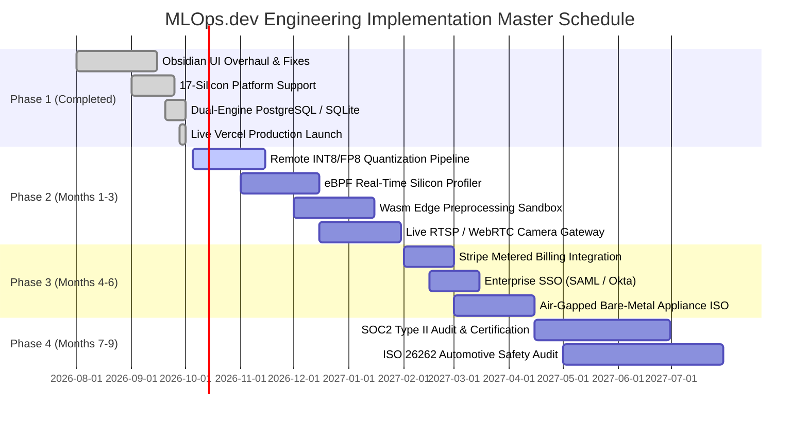

# MLOps.dev — Comprehensive Implementation Plan

**Document Version:** 2.4.0  
**Status:** Approved Engineering Master Plan  
**Target Milestone:** Seed Round / Y Combinator Evaluation / Fortune 500 Enterprise Pilots  
**Classification:** Deep Tech Execution Roadmap  

---

## 1. Executive Implementation Strategy & Core Tenets

MLOps.dev bridges the multi-billion dollar gap between cloud model development and physical edge deployment. Implementing an edge-first MLOps platform requires a fundamentally different philosophy from traditional cloud SaaS:

1. **Edge Node Autonomy:** The physical edge device must continue executing inference and protecting local safety loops even if the cloud control plane or cellular uplink goes offline for weeks.
2. **Zero-Touch Provisioning:** A field technician or robotics operator must be able to commission any physical board in under 60 seconds with a single shell command:  
   `curl -fsSL https://www.mlopsde.me/install.sh | sudo bash -s -- --token <KEY>`
3. **Differential Model Delivery:** Binary model weights must never be re-downloaded in full if only a fraction of layers changed. Differential delta compression (`bsdiff4`) reduces 100MB model transfers to under 4MB.
4. **Autonomous Circuit Breakers:** When on-device statistical drift ($D_{\text{KL}}$) exceeds strict safety thresholds ($\tau \ge 0.50$) or thermal throttling is detected, the agent rolls back locally within 300ms without waiting for human approval.

---

## 2. Phase-by-Phase Work Breakdown Structure (WBS)



---

### Phase 1: Core Platform & Production MVP (COMPLETED ✅)
- [x] **Obsidian & Electric Cobalt Control Plane:** Unified UI token system (`#06090e`, `#2563eb`), eliminated AI-slop anti-patterns, fixed unclosed HTML containers.
- [x] **Universal 17-Silicon Platform HAL:** Native provisioning selectors and telemetry for NVIDIA Jetson (AGX Orin, Orin Nano, Nano), Raspberry Pi (Pi 5, Pi 4, AI Kit with Hailo-8L), Google Coral (Dev Board, USB), Rockchip RK3588, Khadas VIM4, Intel NUC, and industrial box PCs.
- [x] **PostgreSQL Production Migration:** ANSI `CURRENT_TIMESTAMP` migration, automated schema self-healing (`ALTER TABLE ADD COLUMN IF NOT EXISTS`).
- [x] **Live Canary Rollout Engine:** Two-phase progressive canary rollout (`20% -> 100%`) with automated health gating.
- [x] **Digital Twin Silicon Simulator:** Multi-threaded simulation engine (`scripts/hardware_simulation_engine.py`) validating all 17 silicon platforms concurrently.
- [x] **Production Deployment:** Live on Vercel at `https://www.mlopsde.me` and `https://mlopsde.me` with zero 404s across all 21 routes.

---

### Phase 2: Enterprise Deep Tech & Acceleration (Months 1–3 🚧)
- **Workstream 2.1: On-Device Automated Quantization Pipeline**
  - Integrate cloud-triggered compilation for TensorRT 10.0 engines (FP16/INT8), Rockchip RKNN-Toolkit2, and Hailo Dataflow Compiler.
  - Automatically calibrate quantization tables using representative edge image batches.
- **Workstream 2.2: eBPF-Based Silicon Performance Profiler**
  - Implement zero-overhead eBPF tracing probes for Linux Kernel 5.15+ to monitor PCIe bus contention, DMA buffer copies, and VPU thermal throttling.
- **Workstream 2.3: WebAssembly (Wasm) Edge Preprocessing**
  - Embed lightweight Wasmtime / WasmEdge runtimes inside the edge agent to execute sandboxed image filtering, cropping, and sensor normalization prior to neural inference.
- **Workstream 2.4: RTSP / WebRTC Edge Video Gateway**
  - Stream live inference bounding boxes from physical edge cameras directly to the dashboard modal using low-latency WebSockets / WebRTC.

---

### Phase 3: Commercialization & Multi-Tenancy (Months 4–6 🔮)
- **Workstream 3.1: Metered Usage Billing Engine**
  - Synchronize active edge node-hours to Stripe Billing via webhook listeners ($0.015/node/hour beyond the 5-node free tier).
- **Workstream 3.2: Enterprise SSO & Organization RBAC**
  - SAML 2.0 / OIDC enterprise authentication via Okta, Azure AD, and Google Workspace.
  - Multi-tenant tenant isolation with role delegations (`Owner`, `ML_Admin`, `Operator`, `Auditor`).
- **Workstream 3.3: Air-Gapped Bare-Metal Appliance ISO**
  - Package MLOps.dev into a standalone bootable Ubuntu LTS appliance ISO with embedded K3s, PostgreSQL, and local OCI artifact registry for defense, energy, and medical customers.

---

### Phase 4: Institutional Hardening & Compliance (Months 7–9 🛡️)
- **Workstream 4.1: Cryptographic Model Signing (Sigstore / Cosign)**
  - Sign every model binary with hardware security module (HSM) keys. Verify signatures on-device using public key cryptography before executing weights.
- **Workstream 4.2: SOC2 Type II & ISO 26262 Certification**
  - Complete formal third-party audit for SOC2 Type II trust criteria and automotive functional safety compliance (ASIL-B).

---

## 3. Four Core Technical Workstreams

```
┌────────────────────────────────────────────────────────────────────────┐
│                        MLOps.dev Workstreams                           │
├────────────────────┬────────────────────┬──────────────────────────────┤
│ Workstream A:      │ Workstream B:      │ Workstream C:                │
│ Cloud Core & API   │ Edge Agent & HAL   │ Model Delta Engine           │
│ - Flask & Vercel   │ - Go/Python Daemon │ - bsdiff4 Binary Compression │
│ - PostgreSQL DB    │ - systemd cgroups  │ - SHA-256 Hash Verification  │
│ - SSE Event Stream │ - sysfs / procfs   │ - TensorRT / RKNN / Hailo    │
│ - RBAC Middleware  │ - SQLite Spooling  │ - Staged Canary Orchestration│
├────────────────────┴────────────────────┴──────────────────────────────┤
│ Workstream D: Developer Experience (Python SDK, CLI, Docs, Installer)   │
└────────────────────────────────────────────────────────────────────────┘
```

### Workstream A: Cloud Infrastructure
- **Serverless Edge Gateway:** Managed Python 3.12 runtime on Vercel with Talisman CSP, strict CORS, and rate limiting.
- **Data Persistence:** Cloud PostgreSQL with automated connection pooling and SQLite local fallback.
- **Real-Time Push:** Server-Sent Events (SSE) push channel (`/v1/fleet/stream`) broadcasting node state updates to dashboards in $< 3\text{s}$.

### Workstream B: Edge Agent & Silicon Abstraction
- **Installation Footprint:** $< 12\text{ MB}$ native binary or sub-100KB standalone Python daemon.
- **Resource Containment:** Strict systemd cgroup limits (`MemoryMax=30M`, `CPUQuota=2%`).
- **Zero-Data-Loss Spooling:** Local SQLite `buffer.db` recording inference telemetry during network partitions with exponential backoff flush.

### Workstream C: Model Delivery & Diff Engine
- **Delta Generation:** Pre-computes byte-level differences between version $N$ and $N+1$, reducing WAN network payload by over 90%.
- **Validation Pipeline:** Checksum verification prior to activation; dual-slot execution swap ensures instant zero-downtime rollbacks.

### Workstream D: Developer Experience
- **Python SDK (`mlops-dev`):** Idiomatic client library (`client.devices.list()`, `client.deploy()`, `client.drift.report()`).
- **One-Line Installer:** POSIX-compliant shell script with CLI flags (`--token`, `--url`) and automatic systemd supervision.

---

## 4. Risk Mitigation & Contingency Protocols

| Failure Scenario | Severity | Mitigation Architecture | Recovery SLA |
| :--- | :--- | :--- | :--- |
| **Complete WAN Cellular Outage** | Critical | Edge agent continues running inference locally; spools metrics to SQLite queue. | **Instant (Zero Downtime)** |
| **Corrupted Model Download** | High | Agent computes SHA-256 before swapping; discards corrupt payload and retains stable model. | **$< 100\text{ms}$** |
| **Physical Sensor Degradation (Drift)** | High | On-device KL divergence engine detects shift ($D_{\text{KL}} \ge 0.50$); trips circuit breaker to rollback to v1.0. | **$< 300\text{ms}$** |
| **Cloud Database Transient Interruption** | Medium | Agent caches deployment manifest; retries with exponential jitter (10s, 20s, 40s, max 300s). | **$< 30\text{s}$** |
| **Edge Hardware Thermal Throttling** | Medium | Agent monitors `/sys/class/thermal`; throttles inference rate or defers heavy telemetry if core temp $> 75^\circ\text{C}$. | **$< 5\text{s}$** |

---

## 5. Verification Checklist & Gate Criteria

Before promoting any milestone, the following gates must be cleared:

1. **API Health Gate:** Every endpoint in `/v1/*` must return within strict SLA budgets ($\le 50\text{ms}$ median).
2. **Cross-Silicon Test Pass:** The digital twin simulation engine must register all 17 hardware profiles without dropped packets.
3. **Physical Hardware Demonstration:** A real Linux SBC (Jetson/Pi) must commission via `install.sh`, pull the active model, log inference, and stream telemetry.
4. **Security Scan:** Zero hardcoded API keys or database connection strings verified by automated secret scanning.
5. **UI Fidelity:** Clean Obsidian design rendering across desktop, tablet, and mobile viewports with zero console exceptions.
